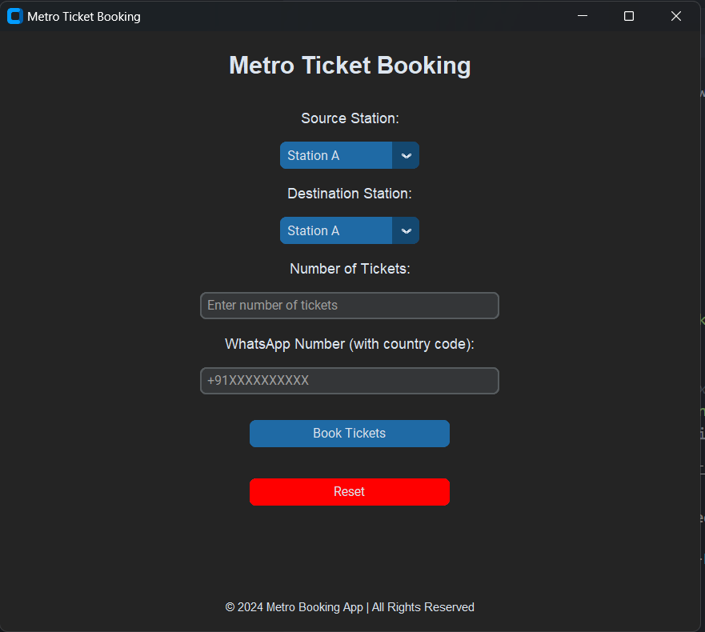
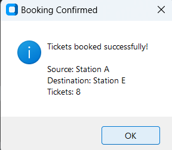

# 🚇 Metro Ticket Booking System

A sleek and efficient Python-based desktop application for metro ticket booking with a modern GUI, automated record-keeping, and WhatsApp integration.

---

## 🌟 Features

✔️ **User-Friendly Interface:** Intuitive and modern design using `CustomTkinter`.
✔️ **Dynamic Station Selection:** Predefined station options for easy booking.
✔️ **Automated Record-Keeping:** Saves all bookings in an Excel file (`MetroBookings.xlsx`).
✔️ **WhatsApp Notifications:** Sends instant booking confirmations.
✔️ **Error Handling:** Ensures accurate and seamless user inputs.

---

## 🖼️ Screenshots

### **Home Screen**

The main screen allows users to select the source, destination, number of tickets, and enter their WhatsApp number.


### **Booking Confirmation**

After booking, users receive a confirmation message on WhatsApp.


---

## 🛠️ Technologies Used

- **Python:** Core programming language.
- **CustomTkinter:** To build a responsive and modern GUI.
- **OpenPyXL:** For managing Excel files.
- **PyWhatKit:** For sending WhatsApp messages programmatically.

---

## 🚀 Installation

Follow these steps to set up the project:

1. **Clone the Repository:**
   ```bash
   https://github.com/prakritrik/Metro-Ticket-Booking-System.git
   ```
